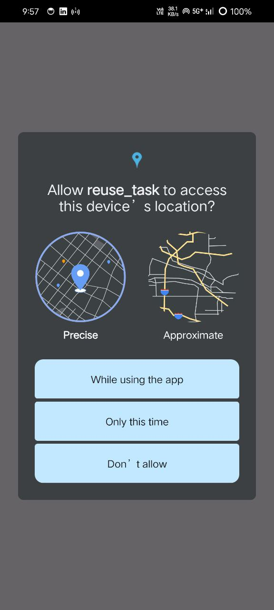
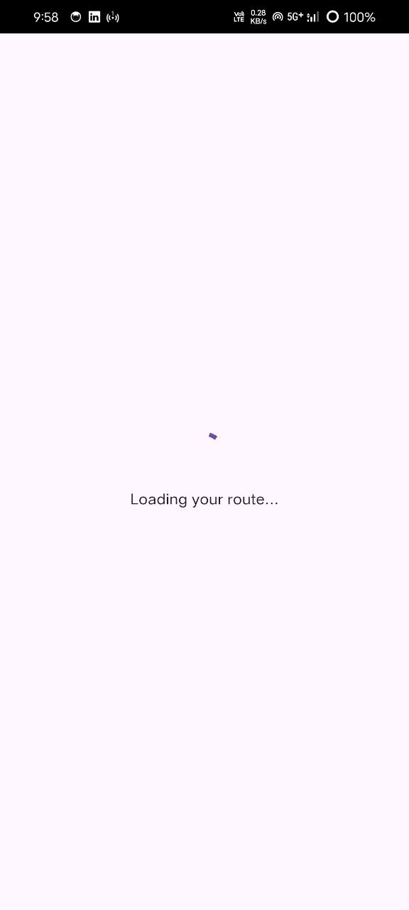
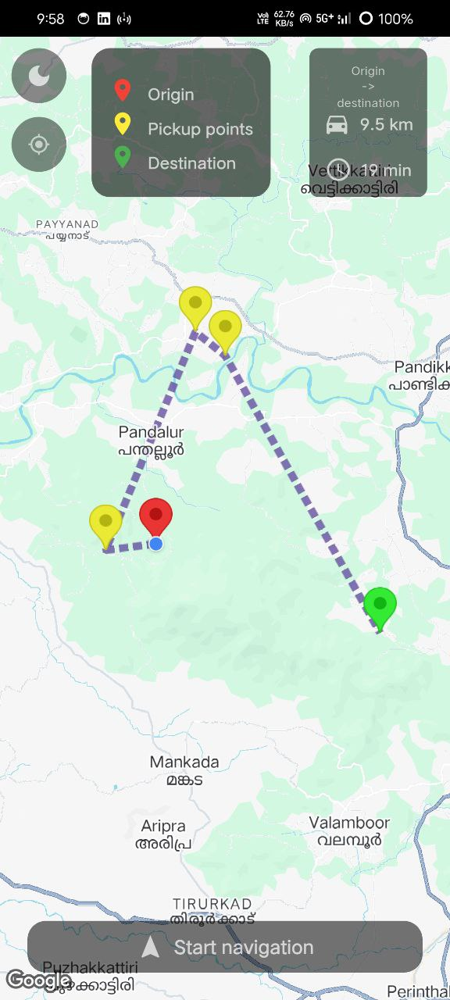
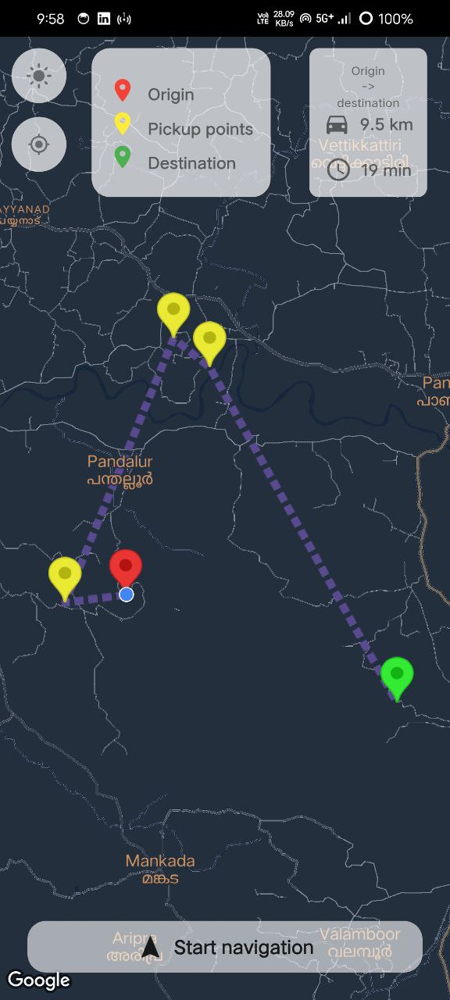
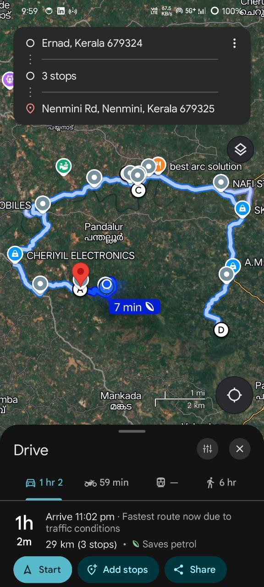

# reuse_task

## Objective

- Build a Flutter app screen for riders to:
  - Display rider's current location on a map.
  - Show markers for pickup locations and warehouse.
  - Draw a full route from rider's current location through all pickups and ending at the warehouse.
  - Enable a navigation experience using a 'Navigate' button to launch either in-app navigation or Google Maps.

## App Screenshots

### Location Permission Screen  

### Loading State  

### Map Preview (Light Theme)  

### Map Preview (Dark Theme)  

### In-App WebView for More Info  

### External Link via URL Launcher  

